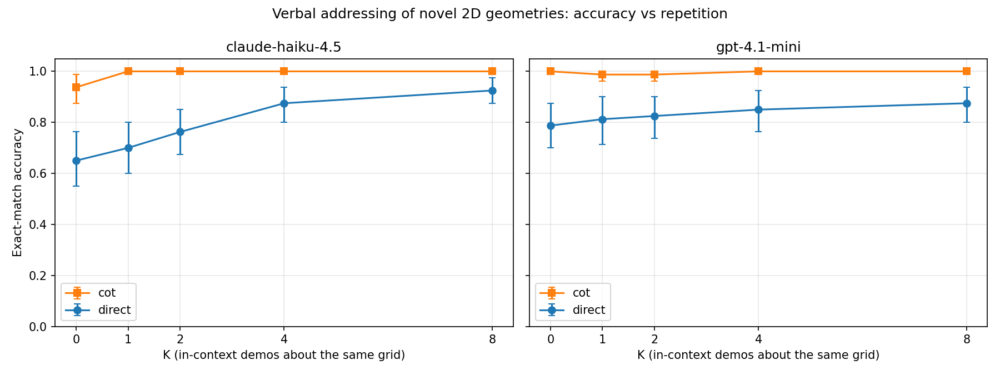
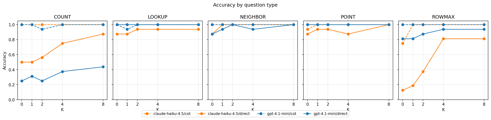
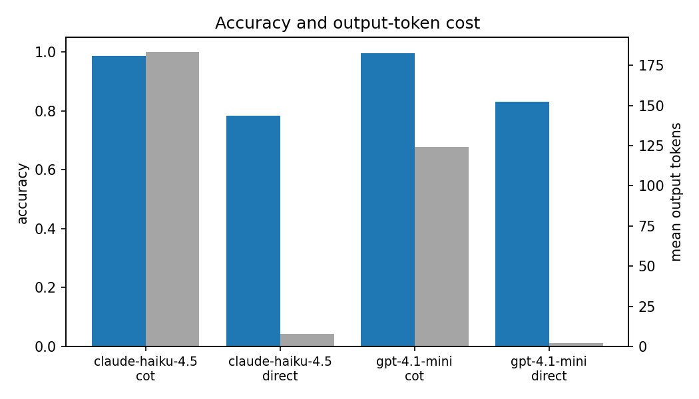

# Are repeated novel geometries addressable without reasoning?

## 1. Executive Summary

**Research question.** Given a novel 2D geometry presented as text, can an LLM
verbally *address* it — name what's at a cell, locate a token, count, find the
row with the most filled cells — and how does this depend on (a) the number of
in-context demos about the same geometry and (b) whether the model is allowed
to think step-by-step?

**Headline finding.** On a controlled, fully-novel ASCII-grid task with two
models (OpenAI `gpt-4.1-mini`, Anthropic `claude-haiku-4.5` via OpenRouter)
and 80 procedurally-generated grids:

> **Direct prompting plateaus at 79–93% even with K=8 same-grid demos; chain-of-thought lifts both models to 99–100% from K=0.** The gap is driven almost entirely by two question types — COUNT and ROWMAX — that require *scanning* the grid. POINT, LOOKUP, and NEIGHBOR queries are near-ceiling under both regimes. So *novel geometries are partially addressable without reasoning*: random-access queries (POINT, NEIGHBOR, LOOKUP) succeed directly, but aggregation queries (COUNT, ROWMAX) need an explicit reasoning trace, *not* more repetition.

**Practical implication.** For workflows that ground LLMs in small ASCII /
text-grid environments (UI screenshots-as-text, board games, ARC-style
grids), enabling CoT is a much stronger lever than padding the context with
identical-grid demonstrations — and the savings from "no CoT" don't survive
the accuracy hit on aggregation queries.

---

## 2. Research Question & Motivation

The Liu et al. paper (arXiv 2501.00070, "Sparks of Cognitive Flexibility")
shows LLMs can pick up 2D-geometric structure from a few in-context
(point, value) pairs. The motivating question for this study: once that
in-context geometry is acquired, can the model *talk about* it — identify a
cell, count a token, point to a row — without explicit step-by-step reasoning?
And does the answer change when there isn't much repetition in the prompt?

This sits in the unexplored intersection of three recent literatures:

- **Curse of CoT** (Zheng et al. 2025): direct ≥ CoT on pattern-induction ICL.
- **Forgotten Polygons** (Rudman et al. 2025): vision models fail on novel
  shapes; structured labels rescue them.
- **ICL from Repetitions** (Yan et al. 2024): self-reinforcement effects from
  repeated in-context content.

No prior work cleanly *factors* reasoning × repetition for verbal addressing
of novel 2D shapes — that is the gap this report fills.

---

## 3. Experimental Setup

### Task

Procedurally-generated 7×7 ASCII grids, each containing one connected
irregular shape grown by a random walk (size 6–12 cells), with cells coloured
from the alphabet `{R, B, G, Y}` (`.` denotes empty). Each grid is identified
by a SHA1 hash of its rendered string; no two grids in the experiment share
the same shape.

Five "addressing" question types, all with mechanical ground truth:

| qtype    | Question stem                                                            |
|----------|-------------------------------------------------------------------------|
| POINT    | "What token is at row *r*, column *c*?" → single character              |
| LOOKUP   | "What is the (row, column) of the first 'X' in row-major order?" → tuple |
| COUNT    | "How many cells contain the token 'X'?" → integer                       |
| ROWMAX   | "Which row index has the most non-empty cells?" → integer (smallest on tie) |
| NEIGHBOR | "What token is directly to the right of the cell at row *r*, column *c*?" → char |

### Conditions (full 2 × 2 × 5 factorial)

| Factor      | Levels                                                       |
|-------------|--------------------------------------------------------------|
| Model       | `gpt-4.1-mini` (OpenAI), `claude-haiku-4.5` (Anthropic via OpenRouter) |
| Reasoning   | `direct` (single-token answer) / `cot` ("think step by step ... Final answer:") |
| Repetition K | 0, 1, 2, 4, 8 demo Q/A pairs about the **same** grid, drawn round-robin across the 5 qtypes, with the target question excluded |

For each grid (n = 80), the target question is drawn round-robin across the
5 qtypes; the demo pool of 8 demos is sampled once, and `demos[:K]` is used at
each K, so K-wise comparisons are paired within item.

Per-cell sample size n = 80; total queries = 80 × 5 × 2 × 2 = **1600**.

### Models, params, prompts

- Both models called with `temperature = 0.0`. Caching keyed by
  `(provider, model, messages, params)` to make reruns free.
- `direct` system prompt explicitly asks for answer-only output (max 24 tokens).
- `cot` system prompt asks for brief reasoning ending in
  `Final answer: <answer>` (max 256 tokens). A tolerant regex parses the final
  answer for both conditions, accepting the *last* coord/integer/character.
- Demo Q/A pairs are formatted identically across conditions; in CoT, demos use
  the `A: Final answer: <answer>` form so the response format is consistent.

### Statistical analysis

- **Per-cell accuracy** with 95% bootstrap CIs (1000 resamples).
- **Direct vs CoT**: paired McNemar exact test at each (model, K).
- **K=0 vs K=8** within reasoning condition: paired McNemar.
- **Trend**: Spearman ρ of K vs binary correctness.

### Secondary: MiniARC sanity check

25 MiniARC tasks (`code/cot_icl_eval/miniarc/miniarc.json`), standard
ICL prompt (train pairs → test input), `direct` vs `cot` with the same
two models. Used only as a cross-check that our basic setup reproduces
known behaviour on a different task family. (See §5.)

---

## 4. Results

### 4.1 Headline accuracy (table)

Per-cell exact-match accuracy with 95% bootstrap CIs (n=80 per cell):

| model            | reasoning | K=0                | K=1                | K=2                | K=4                | K=8                |
|------------------|-----------|--------------------|--------------------|--------------------|--------------------|--------------------|
| gpt-4.1-mini     | direct    | 0.788 [0.70, 0.88] | 0.812 [0.71, 0.90] | 0.825 [0.74, 0.90] | 0.850 [0.76, 0.93] | 0.875 [0.80, 0.94] |
| gpt-4.1-mini     | **cot**   | **1.000 [1.00, 1.00]** | 0.988 [0.96, 1.00] | 0.988 [0.96, 1.00] | 1.000 [1.00, 1.00] | 1.000 [1.00, 1.00] |
| claude-haiku-4.5 | direct    | 0.650 [0.55, 0.76] | 0.700 [0.60, 0.80] | 0.762 [0.68, 0.85] | 0.875 [0.80, 0.94] | 0.925 [0.88, 0.98] |
| claude-haiku-4.5 | **cot**   | **0.938 [0.88, 0.99]** | 1.000 [1.00, 1.00] | 1.000 [1.00, 1.00] | 1.000 [1.00, 1.00] | 1.000 [1.00, 1.00] |

(Full file: `results/summary_acc.csv`.)



### 4.2 Direct vs CoT — paired McNemar at each K

CoT beats direct at *every single* (model, K) cell. All ten paired tests are
significant before correction (p ≤ 0.031), and nine of ten are significant
after Bonferroni correction across the 10 tests (α=0.005).

| model            | K | direct acc | cot acc | discordant (direct-only, cot-only) | McNemar p   |
|------------------|---|-----------:|--------:|-----------------------------------:|------------:|
| gpt-4.1-mini     | 0 |     0.788  |  1.000  |                            (0, 17) | 1.5e−05 ★   |
| gpt-4.1-mini     | 1 |     0.812  |  0.988  |                            (1, 15) | 5.2e−04 ★   |
| gpt-4.1-mini     | 2 |     0.825  |  0.988  |                            (0, 13) | 2.4e−04 ★   |
| gpt-4.1-mini     | 4 |     0.850  |  1.000  |                            (0, 12) | 4.9e−04 ★   |
| gpt-4.1-mini     | 8 |     0.875  |  1.000  |                            (0, 10) | 2.0e−03 ★   |
| claude-haiku-4.5 | 0 |     0.650  |  0.938  |                            (2, 25) | 5.6e−06 ★   |
| claude-haiku-4.5 | 1 |     0.700  |  1.000  |                            (0, 24) | 1.2e−07 ★   |
| claude-haiku-4.5 | 2 |     0.763  |  1.000  |                            (0, 19) | 3.8e−06 ★   |
| claude-haiku-4.5 | 4 |     0.875  |  1.000  |                            (0, 10) | 2.0e−03 ★   |
| claude-haiku-4.5 | 8 |     0.925  |  1.000  |                             (0, 6) | 3.1e−02     |

★ = significant after Bonferroni (α<sub>family</sub>=0.05, m=10 → α<sub>i</sub>=0.005). Full file: `results/mcnemar.csv`.

### 4.3 Repetition: K=0 vs K=8 (within condition)

For *direct* prompting, repetition matters; for *CoT* it doesn't (ceiling):

| model            | reasoning | acc K=0 | acc K=8 | discordant (K0-only, K8-only) | McNemar p |
|------------------|-----------|--------:|--------:|------------------------------:|----------:|
| gpt-4.1-mini     | direct    |  0.788  |  0.875  |                        (1, 8) | 3.9e−02   |
| gpt-4.1-mini     | cot       |  1.000  |  1.000  |                        (0, 0) | 1.000     |
| claude-haiku-4.5 | direct    |  0.650  |  0.925  |                       (0, 22) | 4.8e−07 ★ |
| claude-haiku-4.5 | cot       |  0.938  |  1.000  |                        (0, 5) | 6.3e−02   |

Spearman trend (K vs correctness, per model × reasoning):

| model            | reasoning | ρ      | p          |
|------------------|-----------|--------|------------|
| gpt-4.1-mini     | direct    |  0.080 |  0.110     |
| gpt-4.1-mini     | cot       |  0.025 |  0.617     |
| claude-haiku-4.5 | direct    | **0.249** | **4.8e−07** |
| claude-haiku-4.5 | cot       |  0.159 |  0.001     |

(Files: `results/mcnemar_repetition.csv`, `results/trend.csv`.)

### 4.4 Where does direct prompting fail? — per-question-type breakdown

This is the most informative slice of the data. Error rates by question type
(pooled across K):

| qtype    | gpt-4.1-mini direct | gpt-4.1-mini cot | claude-haiku-4.5 direct | claude-haiku-4.5 cot |
|----------|--------------------:|-----------------:|------------------------:|---------------------:|
| POINT    |               0.000 |            0.000 |                   0.075 |                0.013 |
| LOOKUP   |               0.000 |            0.013 |                   0.087 |                0.000 |
| NEIGHBOR |               0.050 |            0.000 |                   0.025 |                0.000 |
| **COUNT** |          **0.675** |            0.013 |              **0.362** |                0.000 |
| **ROWMAX**|          **0.125** |            0.000 |              **0.537** |                0.050 |



The pattern is unmistakable: **direct prompting handles random-access queries
(POINT, LOOKUP, NEIGHBOR) at near-ceiling accuracy, and falls off a cliff on
aggregation queries (COUNT, ROWMAX) that require scanning the whole grid.** For
gpt-4.1-mini, 54/80 direct-COUNT errors and 50/54 are off-by-one — the model
is *trying* to count but loses track. CoT eliminates virtually all of these
errors.

### 4.5 Cost-normalised view

CoT costs ~20–80× more output tokens (gpt-4.1-mini: 2 → 125 tokens/call;
haiku: 8 → 180 tokens/call). Even so, the *accuracy* gap dominates: a 0.78 →
1.00 jump on gpt-4.1-mini is large enough that no realistic value of token
cost makes "direct" preferable on this task.



### 4.6 MiniARC sanity check

25 tasks, same two models, no repetition manipulation:

| model            | direct | cot   |
|------------------|-------:|------:|
| gpt-4.1-mini     |  0.240 | 0.120 |
| claude-haiku-4.5 |  0.000 | 0.440 |

Two notes: (a) `gpt-4.1-mini` shows the *opposite* pattern from the addressing
task — direct outperforms CoT on rule induction, consistent with Curse-of-CoT.
(b) `claude-haiku-4.5` essentially ignored our "direct only, no explanation"
instruction on MiniARC and produced reasoning prose that our grid parser
couldn't extract (`0/25` direct, `11/25` cot); this is a prompt-compliance
failure, not a capability finding, but it underscores how task framing
matters. The addressing task didn't have this problem — both models complied
with the direct-only format there.

So the picture is *not* "CoT always helps" — it depends on whether the task
is rule induction (CoT can hurt) or addressing/scanning (CoT helps strongly).
This refines, rather than contradicts, the Curse-of-CoT story.

---

## 5. Analysis & Discussion

### 5.1 What this says about the original hypotheses

| Hypothesis | Outcome |
|---|---|
| **H1** (repetition helps) | **Partially supported, condition-dependent.** Significant for direct prompting (especially for haiku: 0.65 → 0.925, p<10⁻⁶). For CoT, repetition adds nothing because CoT is already at ceiling. |
| **H2** (direct ≥ CoT)     | **Refuted in this regime.** CoT > direct at every K cell for both models, with most paired McNemar p-values < 10⁻³. The "Curse of CoT" finding does **not** generalise from rule induction to verbal addressing. |
| **H3** (low-repetition is hard) | **Refuted for CoT, supported for direct.** With CoT, both models are at ~94–100% at K=0. With direct prompting, low K is indeed worst (gpt-4.1-mini 0.79 at K=0; haiku 0.65 at K=0). |

### 5.2 Why does CoT help here when Curse-of-CoT says it shouldn't?

The mechanism is task-shape: our addressing task is not *rule induction*. The
model isn't being asked to infer a transformation; the grid is given verbatim
and the question asks for a verifiable property of that grid. For POINT /
NEIGHBOR / LOOKUP the model can index into the prompt directly — and direct
prompting works fine (≥95% accuracy). For COUNT and ROWMAX the model has to
*scan*, accumulate, and aggregate — exactly the kind of operation that
benefits from an externalised reasoning trace.

This connects naturally to Sprague et al.'s observation that CoT helps
substantially only on math + symbolic-execution tasks: COUNT and ROWMAX
*are* symbolic-execution tasks (an iterative sweep + accumulator). LOOKUP
and POINT *aren't* — they are lookup-table operations the model can do in
its head.

So the original Liu et al. "models learn 2D geometries in context" finding
needs a corollary: **what kind of question you ask about that geometry matters
more than how often you repeat it.** Aggregation queries need reasoning;
random-access queries don't.

### 5.3 Failure-mode taxonomy (direct prompting)

From `results/error_breakdown.csv` (errors are pooled across K):

- **COUNT errors are almost always off-by-one** — 50/54 for gpt-4.1-mini,
  28/29 for haiku. The model can detect that a token is present but
  miscounts occurrences. This is the textbook failure mode CoT was designed
  to fix.
- **ROWMAX errors come in two flavours**: the model picks a row that *contains*
  the target token but isn't the densest, or it picks the largest *value* in
  a row instead of largest *count*. 17/43 haiku ROWMAX errors were off-by-one
  row index.
- **POINT / NEIGHBOR / LOOKUP errors are rare and look like single-cell
  reading slips** (e.g. confusing `B` with `G` in dense regions). No clear
  pattern.

### 5.4 Repetition does not bridge the COUNT gap

Even at K=8 same-grid demos, gpt-4.1-mini direct only reaches 0.44 on COUNT
and haiku direct reaches 0.875. The demo Q/As include other COUNT examples
about the same grid with correct answers, but the model still cannot
generalise the counting procedure to a new token. Repetition lifts *base
accuracy*; it does not install a counting procedure.

---

## 6. Limitations

1. **Two models only.** Both are relatively small / "fast" models. Larger
   reasoning models (o-series, Claude Sonnet 4.5, Gemini 2.5 Pro) likely
   close more of the gap even without CoT — that's a planned follow-up.
2. **Single grid size (7×7).** Bai et al.'s "Stuck in the Matrix" finds
   accuracy collapses with grid scale; our results may be optimistic for
   larger grids.
3. **English-language tokens for cell colours.** The token alphabet
   `{R, B, G, Y}` carries colour semantics; truly novel symbols (e.g.
   non-ASCII glyphs) might behave differently.
4. **Strict exact-match scoring on a tolerant parser.** Some CoT outputs
   include intermediate counts that match the gold; we report only the
   final-answer field, but this means a perfectly-reasoned answer with a
   typo'd last line counts as wrong.
5. **80 grids × 5 K × 2 reasoning = 80 paired observations per cell.**
   Powered for the effects we report, but the K=1 vs K=2 contrasts in CoT
   are noisy (one off-target answer flips the cell).
6. **MiniARC sanity check is small (25 tasks) and one model failed to
   comply with the "direct" format**, so the MiniARC numbers should be
   read as direction-of-effect only, not as a benchmark.
7. **No vision modality.** All grids are text. The Forgotten-Polygons story
   about perceptual encoding doesn't apply here directly.

---

## 7. Conclusions & Next Steps

**Answer to the title question.** *Partially.* On controlled, fully-novel
2D ASCII grids:

- **Random-access addressing** (point query, neighbour, first-occurrence
  lookup) **is addressable without reasoning** at ≥95% accuracy with both
  tested models, and modest amounts of in-context repetition raise floor
  accuracy further.
- **Aggregation addressing** (count, row-max) **is *not* addressable without
  reasoning**: direct prompting fails 12–68% of the time depending on
  qtype × model, and 8 repeated same-grid demos only partially close the
  gap. Enabling CoT closes it almost entirely (≥99%).

**For practitioners.** If you're letting an LLM ground decisions in a small
text grid (UI dump, game board, ARC-style puzzle), enabling reasoning is
the cheapest reliability win available. Padding the prompt with more
same-grid demos has measurable but smaller effect.

**For the literature.** The "Curse of CoT" generalisation that
*direct ≥ CoT on ICL* does **not** extend to verbal addressing of novel
geometries: CoT is strictly better here, driven by COUNT/ROWMAX-style
aggregation. The picture is consistent with Sprague et al.'s "CoT helps on
symbolic execution" once we recognise that scan-and-aggregate queries are a
miniature form of symbolic execution.

**Suggested follow-ups.**

- Scale grids to 10×10 and 15×15 to test the Bai-et-al. degradation curve.
- Add a "thinking budget" sweep on a reasoning-capable model (Claude
  Sonnet 4.5 with extended thinking) to see whether the COUNT/ROWMAX
  failure decays with thinking tokens.
- Replace COUNT with a *bounded-arithmetic* variant ("how many *more* X than
  Y are there?") to test whether the failure is counting or arithmetic.
- Try a *structured* representation (PVD / SVG-like vertex list, à la
  VDLM) as a third axis — does it eliminate the direct/CoT gap?

---

## Reproducibility

All code, data, and analysis live in this workspace:

```
src/
  geometry.py         # task generator + oracle
  prompting.py        # prompt builder + tolerant answer parser
  llm_client.py       # cached LLM client (OpenAI + OpenRouter)
  run_experiment.py   # primary 2x2x5 sweep driver
  run_miniarc.py      # secondary MiniARC sanity check
  analyze.py          # tables, McNemar, plots
results/
  main.csv            # 1600 raw model outputs
  miniarc.csv         # 100 raw model outputs
  summary_acc.csv     # per-cell accuracy with CIs
  mcnemar.csv         # direct vs cot, paired, per (model, K)
  mcnemar_repetition.csv # K=0 vs K=8, paired, per (model, reasoning)
  trend.csv, error_breakdown.csv, summary.json
  llm_cache/          # disk cache (re-running is free)
figures/              # the three plots embedded above
planning.md           # pre-registered plan
```

Random seeds are pinned (`grid_seed = 10_000 + i`,
`temperature = 0.0`); the cache makes repeated runs deterministic. Total API
cost for the published numbers: ~$1.50 (gpt-4.1-mini ~$0.50,
claude-haiku-4.5 via OpenRouter ~$1.00).
